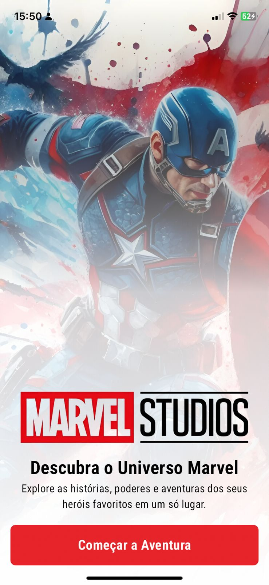
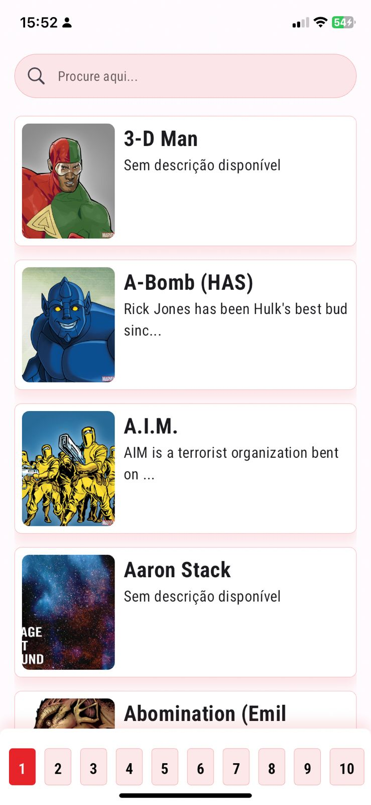
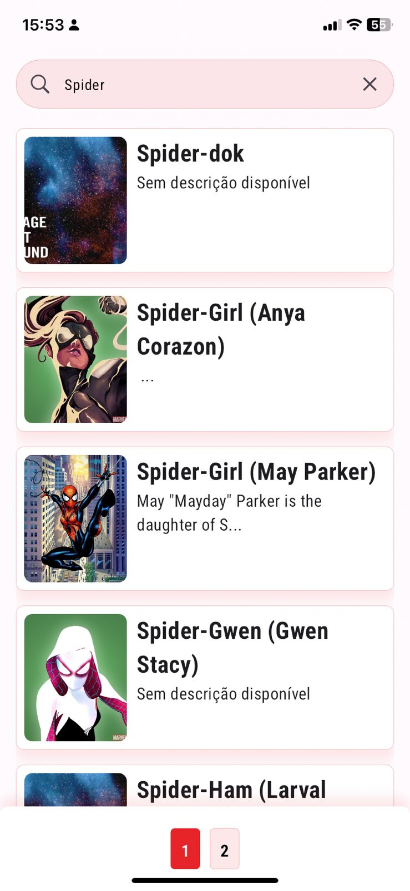
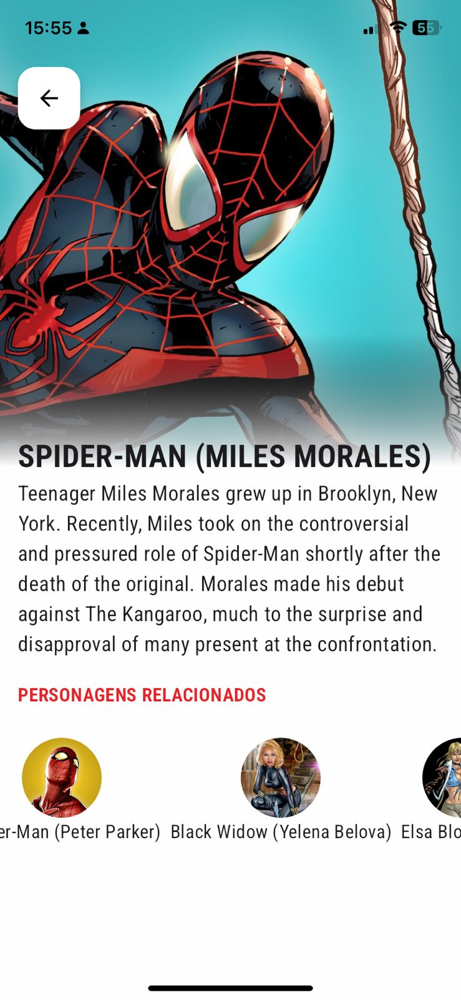

# Nível 3 - App Marvel(Vaga - Dev Flutter SR)

## Funcionalidades

- **Página de Splash**
  - Implementei uma tela inicial de carregamento com logotipo e animações.
  
- **Página Inicial com Heróis**
  - Criei uma página inicial que exibe uma lista de heróis da Marvel.
  
- **Componente para Filtro com o Nome do Herói**
  - Desenvolvi um componente para filtrar heróis pelo nome, facilitando a pesquisa.
  
- **Paginação**
  - Implementei paginação tanto para a listagem normal de heróis quanto para os resultados de pesquisa.
  
- **Card Customizado**
  - Criei cartões customizados que exibem a imagem, o nome e uma breve descrição de cada herói.
  
- **Página de Detalhes do Herói**
  - Desenvolvi uma página que exibe informações detalhadas sobre o herói selecionado.
  - Adicionei uma lista de heróis recomendados relacionados ao herói selecionado.
  
- **Página de Detalhes dos Itens Recomendados**
  - Implementei uma página para exibir detalhes específicos dos heróis recomendados.
  
- **Consumo da API**
  - Utilizeo o Dio como cliente HTTP para fazer requisições à API da Marvel.
  
- **Cache de Dados**
  - Implementei o Dio Cache Interceptor para cachear dados das requisições.
  - Configurei a limpeza do cache ao fechar a aplicação.
  
- **Gerenciamento de Estado e Navegação com GetX**
  - Utilizeo o GetX para gerenciamento de estado, navegação entre páginas e outros recursos oferecidos pelo pacote.
  
- **Firebase Analytics**
  - Integrei o Firebase para análise de dados e eventos do aplicativo.
  
- **Integração com Kotlin para Verificação da Internet**
  - Utilizeo o MethodChannel do Flutter para integrar com Kotlin e verificar a conectividade com a internet.
  
- **Build para iOS**
  - Preparei e configurei o aplicativo para rodar em dispositivos iOS.

## Tecnologias Utilizadas

# NÍVEL 1 - nome da branch (level_1):
- Executar etapas iniciais;
- Mostrar a listagem dos personagens (imagem e nome);
- Ação de clique nos cards da listagem e exibir os detalhes (imagem, nome e descrição);

# NÍVEL 2 - nome da branch (level_2):
- Executar etapas iniciais;
- Guardar em cache as consultas realizadas na API Marvel;
- Mostrar a listagem dos personagens (imagem e nome);
- Criar um filtro para a listagem;
- Ação de clique nos cards da listagem e exibir os detalhes (imagem, nome, descrição e personagens relacionados);

# NÍVEL 3 - nome da branch (level_3):
- Executar etapas iniciais;
- Criar uma Splashscreen customizada;
- Guardar em cache as consultas realizadas na API Marvel;
- Limpar cache de consultas no fechamento do APP;
- Mostrar a listagem dos personagens (imagem e nome);
- Criar um filtro para a listagem;
- Ciar uma paginação da listagem;
- Ação de clique nos cards da listagem e exibir os detalhes (imagem, nome, descrição e personagens relacionados);
- Ação de clique nos personagens relacionados e exibir os detalhes (imagem, nome, descrição e personagens relacionados);

> Ao final de cada etapa, criar PR para a branch **main** e realizar o merge.

# Pontos extras (opcional):
- Utilizar Getx.
- Configurar Firebase crashlytics.
- Criar channel em kotlin, capturar a mudança de conexão, e mostrar uma mensagem de offline no flutter.

# SCREENSHOOTS

<table>
  <tr>
    <td></td>
    <td></td>
  </tr>

  <tr>
    <td></td>
    <td></td>
  </tr>
</table>

